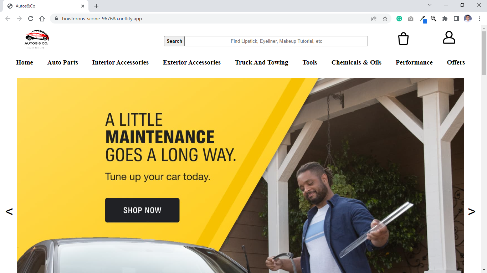
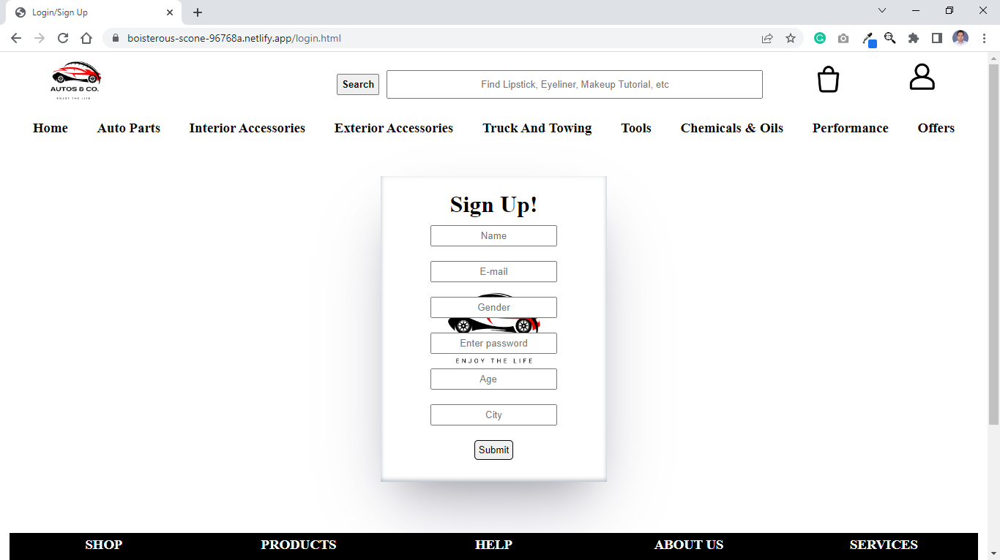
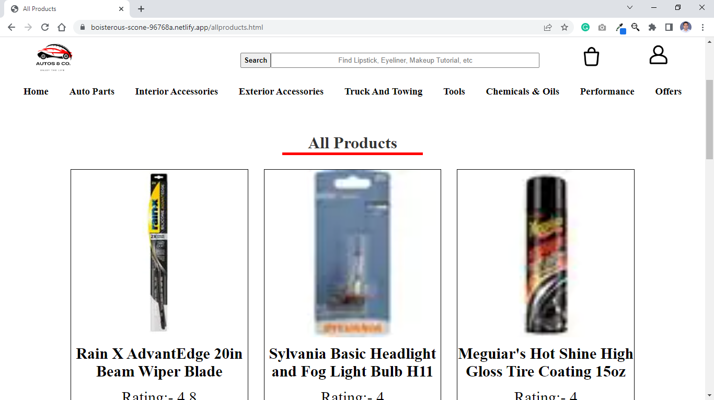
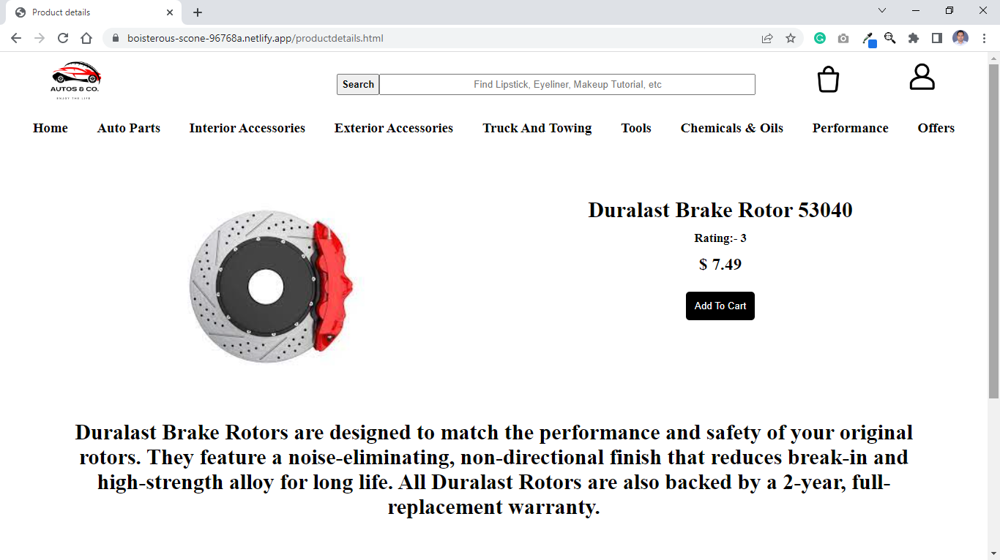
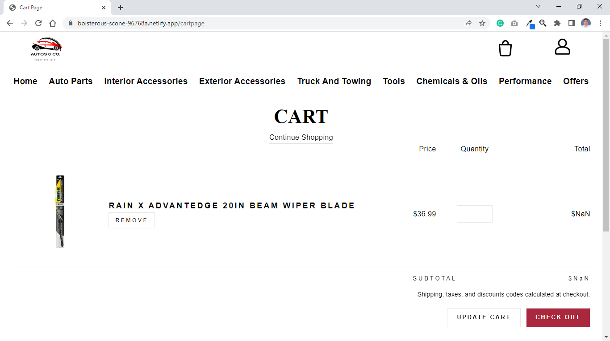

# Autos&co a AutoZone clone

    Autos&co is the clone of the Autozone, a populer website for buy a automotive parts 

##  Authors
[@Vishal Dnyandeo Patil](https://www.github.com/VishalDnyandeoPatil)

## Features

- featching api

- Sign in

- App product page

- Authentication

## Roadmap

- landing Page/ Home Page 

- Sign In / Sign Up Page 

- Product Page 

- Single product Page

- Cart Page

- Back end 

## Deployed link 
https://boisterous-scone-96768a.netlify.app/

## Screenshots

 
 
<h2> Landing Page/ Home Page</h2>
 
 

 
 

 
 
<h2>Sign Up Page </h2>
 
 

 
 

 
 
<h2> Sign In Page </h2>
 
 

 
 

 
 
<h2> Product Page </h2>
 
 

 
 

 
 
<h2> Single product Page </h2>
 
 

 
 

 
 
<h2> Cart Page </h2>
 
 

 
 

